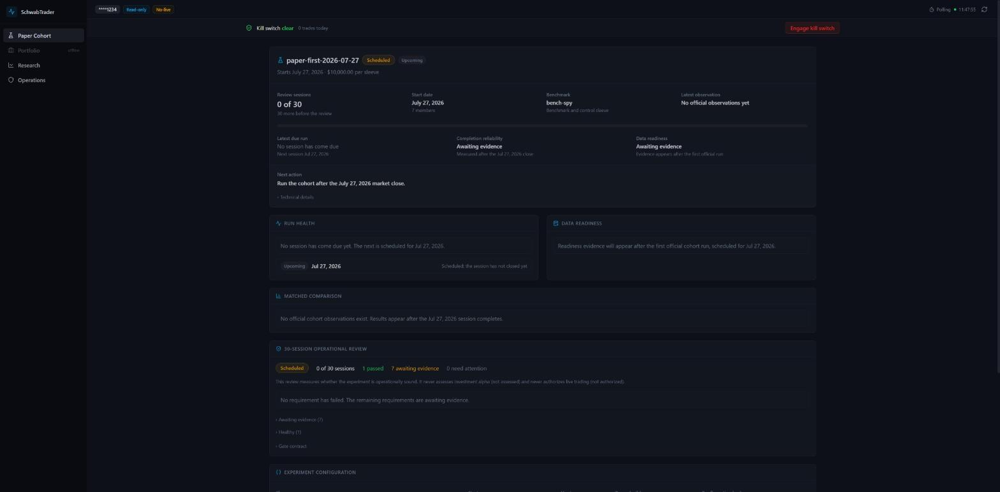
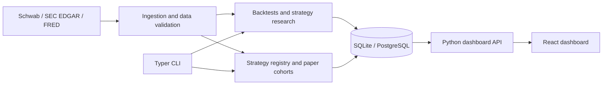

# Personal Trading & Quantitative Research Platform

[](https://github.com/kyles05git/SchwabAPI-Portfolio/actions/workflows/ci.yml)

A Python and React application for researching trading strategies, comparing simulated
portfolios, and inspecting the data behind each result. It integrates Charles Schwab
market data, SEC EDGAR fundamentals, and FRED macroeconomic indicators with a typed CLI,
a local web dashboard, and SQLite or shared PostgreSQL storage.

Built by **Kyle Scopel** as a personal software engineering and quantitative research
project. This public portfolio contains the application source and synthetic demo
fixtures. Runtime credentials, databases, and private experiment records are excluded.
The command-line application is named `schwab-trader`.

[Explore the dashboard](#explore-the-dashboard) | [Architecture](#architecture) |
[Getting started](#getting-started) | [Documentation](#documentation)



*Dashboard preview using synthetic fixture data and a masked example account.
All capital and observations shown are simulated.*

## Project overview

The platform follows a strategy from historical research through forward paper testing
and operational review. A **sleeve** is an isolated simulated portfolio. A **cohort**
groups sleeves under fixed experiment definitions, allowing strategies to be compared
against a market benchmark and a cash control using matched observations.

The engineering focus is reproducibility: preserve the configuration, input data,
execution assumptions, and recorded state needed to explain a result. Missing data,
interrupted runs, and ambiguous identities are explicit states in the application.

Paper trading and backtesting use simulated capital. A separate brokerage integration
supports restricted live order workflows, with live trading disabled by default. This
is a personal-use research application; simulated results do not establish investment
performance or authorize live trading.

## Capabilities

- **Strategy research:** historical backtesting, walk-forward evaluation, transaction
  cost modeling, fundamental factor ranking, and validation records with data and
  configuration provenance. An optional Claude integration generates research
  specifications for an LLM-driven paper strategy.
- **Paper portfolios and cohorts:** isolated cash and positions, configurable T+1 cash
  settlement, immutable strategy definitions, benchmark comparisons, and durable
  session records. The registry includes momentum, trend, low volatility, fundamental
  factor ranking, value-momentum, mean reversion, and post-earnings drift strategies.
- **Market and fundamental data:** daily and intraday price history, point-in-time SEC
  XBRL queries, trailing-twelve-month ratios, and FRED macro context. When an official
  daily candle is unavailable, complete validated regular-session five-minute bars can
  supply a derived daily candle with its underlying evidence retained.
- **Dashboard:** cohort progress and readiness, matched comparisons, equity history,
  paper positions and orders, sleeve detail, historical cohorts, accounting reviews,
  and operator decisions. Portfolio, research, and operations views provide additional
  context.
- **Storage and operations:** local SQLite or shared PostgreSQL through SQLAlchemy,
  Alembic migrations, database-backed run coordination, health checks, backup
  verification, recovery inspection, and deduplicated notifications.
- **Brokerage integration:** OAuth 2.0 authentication, account and quote retrieval,
  order preview and lifecycle tracking, risk checks, duplicate protection, and an
  emergency kill switch. Supported live orders are whole-share U.S. equity/ETF
  buy/sell limit orders for the regular session with DAY duration.

The three versioned challenger strategies (dual momentum, quality/profitability, and
short-term mean reversion) have a separate
[frozen experiment contract](docs/architecture/challenger-v1-contract.md). Their
implementation and bootstrap tooling are present; next-session opening-data integration
remains deferred as described in the
[execution methodology](docs/operations/t1-open-execution.md#current-integration-boundary).

## Engineering design

**Reproducible experiments.** Stable sleeve IDs distinguish portfolios with the same
display name. Configuration hashes, snapshot identities, and versioned execution
methodologies preserve what an experiment actually ran. Historical replay is stored
separately from forward cohort evidence.

**Explicit readiness and recovery.** A cohort-wide preflight checks all members before
paper execution begins. Incomplete market data leaves the session retryable within its
calendar deadline. Persisted run identities, leases, and checkpoints prevent repeated
invocations from silently duplicating observations or replaying uncertain mutations.

**Consistent persistence.** SQLite and PostgreSQL adapters implement shared repository
contracts. Schema-parity tests exercise the Alembic migration chain; PostgreSQL adds
advisory locking for official cohort runs. Credentials and live-account safety state
remain outside the shared research database.

**Auditable review.** Accounting checks, explanatory notes, and operator decisions are
append-only records. The 30-session review measures operational quality; it does not
claim statistical evidence of alpha or grant permission to trade real money.

## Architecture

The main research and paper-trading flow is:



Brokerage order submission follows a separate gated path. The dashboard reads through
`GET /api/data`, with individual sleeve history loaded from `GET /api/sleeve`. Its
current Python backend serves HTTP polling; the React view refreshes every 30 seconds.
The dashboard's only write action engages the kill switch.

| Component | Implementation |
| --- | --- |
| CLI and application wiring | [`cli.py`](src/schwab_trader/cli.py), [`scripts/`](scripts/) |
| Strategy definitions and implementations | [`strategy_registry.py`](src/schwab_trader/strategy_registry.py), [`agent.py`](src/schwab_trader/agent.py), [`strategies/`](src/schwab_trader/strategies/) |
| Paper execution and cohort orchestration | [`paper.py`](src/schwab_trader/paper.py), [`sleeve_runs.py`](src/schwab_trader/sleeve_runs.py), [`cohort_preflight.py`](src/schwab_trader/cohort_preflight.py) |
| Historical research and data evidence | [`backtest.py`](src/schwab_trader/backtest.py), [`market_bar_evidence.py`](src/schwab_trader/market_bar_evidence.py), [`sec_edgar.py`](src/schwab_trader/sec_edgar.py) |
| Persistence and schema evolution | [`storage/`](src/schwab_trader/storage/), [`alembic/`](alembic/) |
| Dashboard API and interface | [`dashboard.py`](src/schwab_trader/dashboard.py), [`frontend/src/`](frontend/src/) |
| Verification | [`tests/`](tests/), [GitHub Actions](.github/workflows/ci.yml) |

## Technology stack

| Layer | Technologies |
| --- | --- |
| Backend | Python 3.12+, Typer, Rich, Pydantic, HTTPX |
| Frontend | React, TypeScript, Tailwind CSS, Vite, Recharts |
| Persistence | SQLite, PostgreSQL, SQLAlchemy 2, psycopg, Alembic |
| Integrations | Charles Schwab APIs, SEC EDGAR, FRED, optional Anthropic API |
| Quality and delivery | pytest, respx, Ruff, mypy, GitHub Actions |

## Explore the dashboard

The frontend includes synthetic scenarios for inspecting the interface without a
brokerage login, a database, or a running Python backend. From the repository root,
with Node.js 22.12+ and npm installed:

```powershell
cd frontend
npm ci
npm run dev
```

Open the local address printed by Vite with `/?fixture=collecting` appended, for example
`http://localhost:5173/?fixture=collecting`. Other scenarios include
`first-session-complete`, `review-recorded`, and `historical-cohorts`. These fixtures
contain synthetic data and are available only in development mode.

## Getting started

The following commands use Windows PowerShell. On macOS or Linux, create the environment
with `python3.12 -m venv .venv` and activate it with `source .venv/bin/activate`.

```powershell
git clone https://github.com/kyles05git/SchwabAPI-Portfolio.git
cd SchwabAPI-Portfolio
py -3.12 -m venv .venv
.\.venv\Scripts\Activate.ps1
python -m pip install --upgrade pip
python -m pip install -e ".[dev]"
schwab-trader --help
```

For a configured local installation, copy `.env.example` to `.env` and supply only the
integrations you intend to use. Brokerage features require a Schwab developer app with
Accounts & Trading and Market Data access. SEC EDGAR requires a contact User-Agent;
FRED and the optional Anthropic research workflow use their respective API keys.
Keep the template's dry-run and trading-disabled defaults during setup.

Build the frontend, then start the Python-hosted dashboard from the repository root:

```powershell
cd frontend
npm ci
npm run build
cd ..
schwab-trader serve --no-live
```

The dashboard is available at `http://localhost:8787`. `--no-live` disables live
brokerage data collection; it still reads the configured application storage. Node.js
is needed to build the frontend, while the built application is served by Python.

Use the [CLI and configuration guide](docs/operations/cli-reference.md) for authentication,
research commands, and paper runs. Run application commands from the repository root
because configuration and local state paths are relative to it. A shared PostgreSQL
installation requires the [migration runbook](docs/migrations/postgresql-runbook.md);
application startup does not apply schema migrations automatically.

## Development

```powershell
ruff check .
mypy src
pytest -q
```

GitHub Actions runs these backend checks and builds the TypeScript frontend on pull requests and pushes to `main`. The
backend includes **2,300+ automated tests**. The default suite uses synthetic data and
mocked HTTP, covering authentication,
redaction, order ambiguity, paper accounting, session readiness, interruption recovery,
point-in-time data, and migration parity. Optional PostgreSQL integration tests require
an explicitly configured disposable database and are skipped by default.

For frontend changes, run `npm ci` and `npm run build` in `frontend/`; the build includes
TypeScript checking. Synthetic dashboard scenarios support visual inspection.

Repository work is coordinated through GitHub Issues, isolated worktrees, PR reviews,
and durable handoffs. See [AGENTS.md](AGENTS.md) and the
[coordination protocol](docs/AGENT_COORDINATION.md). Project-local skills provide
on-demand implementation, review, research-review, and diagnostic procedures.

## Documentation

| Topic | Guide |
| --- | --- |
| CLI setup, authentication, and common commands | [CLI reference](docs/operations/cli-reference.md) |
| Paper cohort scheduling, readiness, and retries | [Scheduler setup](docs/operations/cohort-scheduler-setup.md) |
| Market-data completeness and derived daily bars | [Schwab bar evidence](docs/operations/schwab-bar-evidence.md) |
| Cohort accounting and operator decisions | [Accounting review](docs/operations/cohort-accounting-review.md) |
| Active and historical cohort selection | [Cohort lifecycle](docs/operations/cohort-rollover.md) |
| Shared storage and database migration | [Architecture](docs/architecture/shared-storage.md) / [Migration](docs/migrations/postgresql-runbook.md) |
| Backups, restore rehearsals, and recovery | [Backup and restore](docs/operations/storage-backup-restore.md) / [Operator checklist](docs/operations/storage-operator-checklist.md) |
| Historical five-minute research datasets | [Historical replay](docs/operations/historical-replay.md) |
| Trading boundaries and credential handling | [Safety contract](docs/SAFETY.md) |

## Research limitations and next steps

Historical coverage depends on the provider, and a universe of currently listed
securities introduces survivorship bias. Price-return and total-return data are not
interchangeable, and modeled fills do not reproduce every feature of market execution.
These assumptions must be evaluated alongside any reported backtest result.

Current development priorities include completing challenger opening-data integration,
collecting and reviewing forward cohort evidence, and expanding point-in-time data
coverage. HMM regime models, gradient-boosted ranking, and reinforcement learning are
future research directions, not implemented portfolio-performance claims.

## License and use

Proprietary; developed for the author's personal use. This repository documents a
software engineering and research project and does not grant an open-source license
or provide investment advice.
